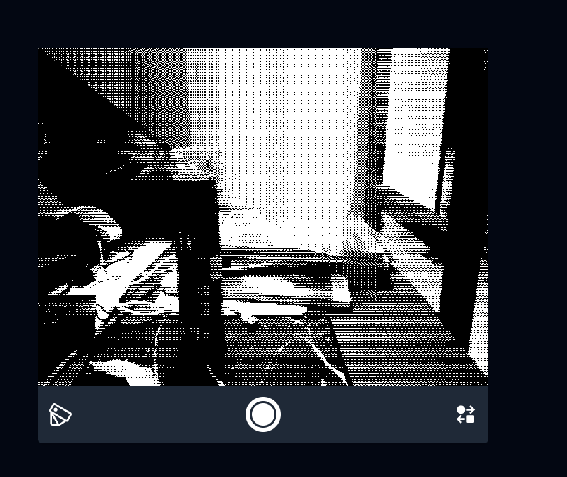

# Pixless 🎨

Pixless is a web-based tool for real-time video and image color manipulation using GLSL shaders and HALD (Hald Lookup Table) color look-up tables. It's a playground for experimenting with color palettes and their effects on live video streams or images.

**Check out the live version at [pixless.pages.dev](https://pixless.pages.dev).**

## Features

- **Real-time Camera Processing:** Applies color transformations to your webcam feed in real-time.
- **Custom Color Palettes:** Define your own color palettes using hex codes.
- **Image Support:** Drag and drop an image to apply the effects to a static picture.
- **HALD LUT Transformation:** Uses HALD images as a basis for color look-up tables, which are then remapped to your custom palette.
- **WebGL Shaders:** All color processing is done on the GPU using WebGL and GLSL for high performance.
- **Palette Persistence:** Your last used palette is saved in your browser for convenience.
- **LUT Screenshot:** You can download the generated LUT as a PNG file.

## How It Works

The core of Pixless is the concept of a **Hald Lookup Table (LUT)**.

1.  **Identity LUT:** The application first generates a "neutral" HALD image. This image contains a representation of all possible RGB colors.
2.  **Palette Remapping:** This identity LUT is then processed by a GLSL shader. The shader remaps the colors in the LUT to the nearest colors in your custom-defined palette. This creates a new, modified LUT that represents the color transformation.
3.  **Real-time Application:** Another GLSL shader takes the live video feed (or an image) and the modified LUT. For each pixel of the input, it uses the color of the pixel to "look up" the corresponding transformed color in the modified LUT and displays it on the screen.

This process is highly efficient as the complex color mapping is pre-calculated into the LUT, and the final application is a simple texture lookup, which is very fast on the GPU.

## Usage

- **Allow Camera Access:** When you first visit the site, your browser will ask for permission to use your camera.
- **Change Palette:** Click the palette icon to open a dialog where you can paste a list of hex color codes (e.g., from a site like [Lospec](https://lospec.com/palette-list)).
- **Switch Camera:** If you have multiple cameras, you can switch between them using the switch camera button.
- **Use an Image:** Drag and drop an image file onto the viewfinder area to use it as a source instead of the camera.
- **Take a Screenshot:** The shutter button will download the currently generated LUT as a PNG file.

## Development

This project uses `esbuild` for bundling and `tailwindcss` for styling.

To get started, clone the repository and install the dependencies:

```bash
npm install
```

To run the development server with live reloading:

```bash
npm run develop
```

This will watch for changes in the TypeScript and CSS files and rebuild them automatically.

To create a production build:

```bash
npm run build:js
npm run build:css
```